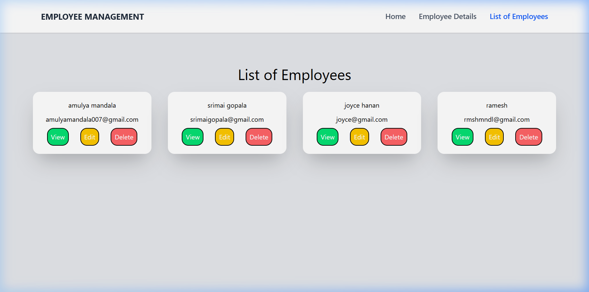
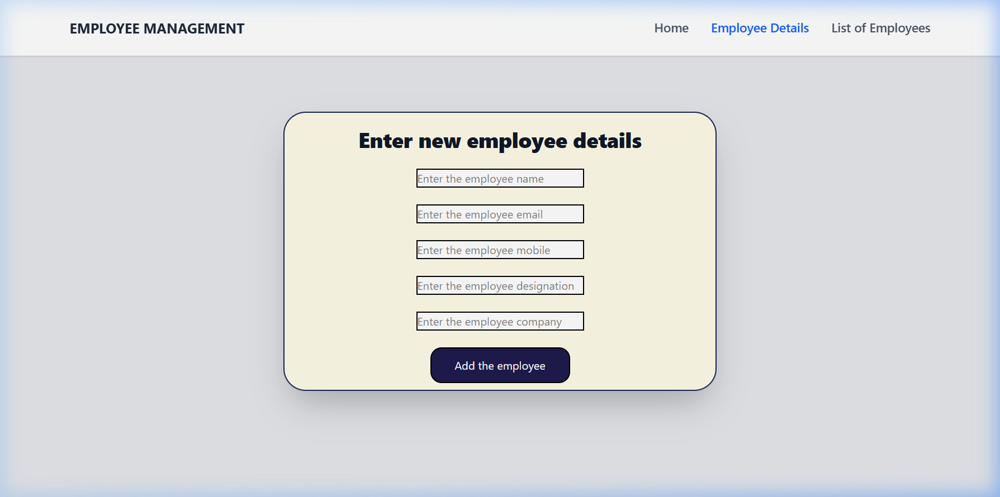
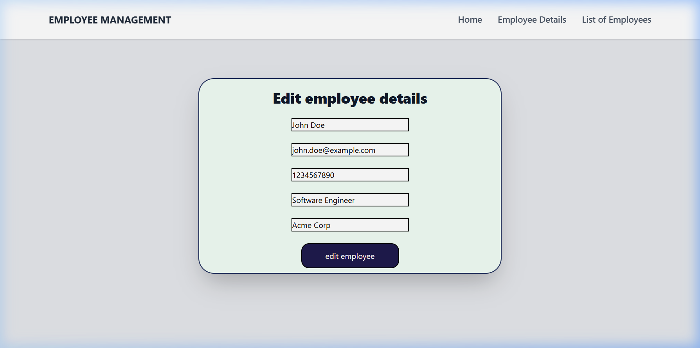

# 👥 Employee Management System

A modern, full-stack Employee Management application built with the **MERN** stack. This application allows users to manage employee records seamlessly with a clean and responsive user interface.

[](https://employee-management-three-pied.vercel.app/)
[](https://employee-management-three-pied.vercel.app/)
[](https://employee-management-62yk.onrender.com/)

---

## 🚀 Live Demo
Check out the live application here: [Employee Management App](https://employee-management-three-pied.vercel.app/)

---

## ✨ Features

- **Dashboard**: View a comprehensive list of all employees in a grid layout.
- **Create Employee**: Easily add new employees with detailed information (Name, Email, Position, Salary, etc.).
- **Edit Details**: Update existing employee records on the fly.
- **Delete Records**: Remove employee profiles with a single click.
- **Responsive Design**: Optimized for mobile, tablet, and desktop views using Tailwind CSS.
- **State Management**: Efficient data handling using Zustand.
- **Form Validation**: robust form handling with React Hook Form.

---

## 📸 Screenshots

### 🖥️ Dashboard / Employee List


### ➕ Add New Employee


### ✏️ Edit Employee Details


---

## 🛠️ Tech Stack

### Frontend
- **React 19**: Core UI framework.
- **Vite**: Ultra-fast frontend build tool.
- **Tailwind CSS 4**: Modern utility-first CSS framework for styling.
- **React Router 7**: Declarative routing for navigation.
- **Zustand**: Lightweight state management.
- **Axios**: Promise-based HTTP client for API requests.
- **React Hook Form**: Performant and extensible forms.

### Backend
- **Node.js**: JavaScript runtime environment.
- **Express 5**: Fast, unopinionated web framework.
- **MongoDB**: NoSQL database for data storage.
- **Mongoose**: Elegant mongodb object modeling for node.js.
- **JWT (JSON Web Tokens)**: Secure authentication (ready for expansion).
- **Bcryptjs**: Password hashing and security.

---

## ⚙️ Installation & Setup

Follow these steps to get the project running locally on your machine.

### Prerequisites
- Node.js installed
- MongoDB account (Atlas or Local)

### 1. Clone the Repository
```bash
git clone https://github.com/amulyamandala/employee-management.git
cd employee-management
```

### 2. Backend Setup
```bash
cd backend
npm install
```
- Create a `.env` file in the `backend` directory and add your MongoDB URI:
```env
PORT=4000
DB_URL=your_mongodb_connection_string
```
- Start the server:
```bash
npm start
```

### 3. Frontend Setup
```bash
cd ../frontend
npm install
npm run dev
```
- Open [http://localhost:5173](http://localhost:5173) in your browser.

---

## 📂 Project Structure

```text
employee-management/
├── backend/                # Express & Node.js Server
│   ├── APIs/               # API Route Handlers
│   ├── models/             # Mongoose Schemas
│   ├── server.js           # Entry point
│   └── .env                # Environment Variables
├── frontend/               # React & Vite Application
│   ├── src/
│   │   ├── components/     # UI Components
│   │   ├── store/          # Zustand State Store
│   │   └── App.jsx         # Main Routing
│   └── tailwind.config.js
└── screenshots/            # Project Screenshots
```

Developed by [Amulya Mandala](https://github.com/amulyamandala)
